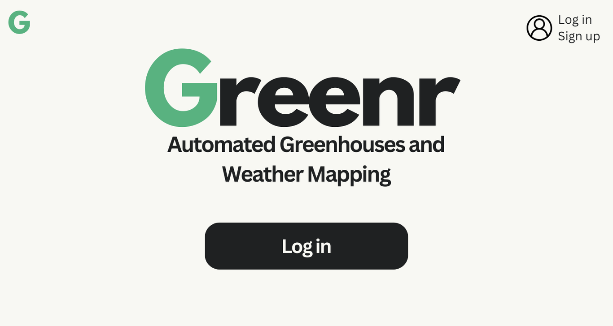
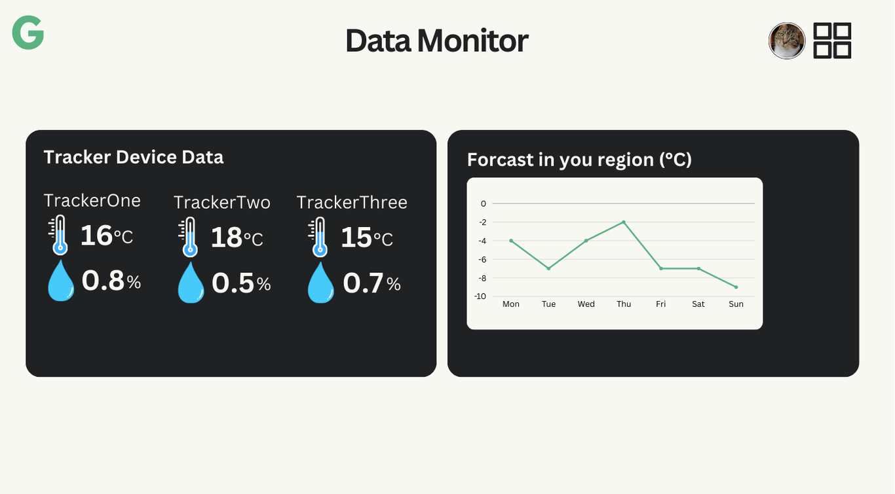

# The Greenr Project - Client App

### Purpose
The Greenr project aims to make temperature monitoring and environmental data tracking automated and simple. The purpose of this client app is to allow for an easy and cost effective way for individuals to interface with our technology.

### Concept UI

### Implementation Plan
| Feature | Estimated Completion Date | Actual Completion Date |
| ------- | ------------------------- | ---------------------- |
| Build Basic App UI for Login Page | 2 Feb 2025 | N/A |
| Connect Login System to MongoDB Database | 21 Feb 2025 | N/A |
| Build Basic App UI for Data Monitor Page for Regional Forecast only | | |
| Connect Regional Forecast to Weather API | | |
| Allow for multiple accounts to be used | | |